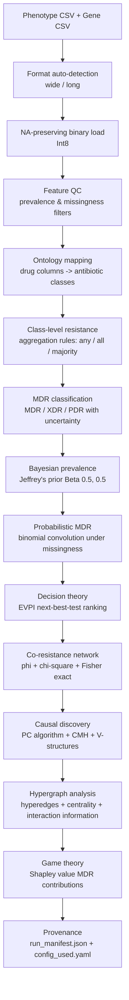

# bact-mdr-profiler

[](https://github.com/MK-vet/bact-mdr-profiler/actions/workflows/ci.yaml)
[](https://pypi.org/project/bact-mdr-profiler/)
[](https://pypi.org/project/bact-mdr-profiler/)
[](LICENSE)

Causal co-resistance discovery with hypergraph multi-drug resistance modelling.

## Pipeline Architecture



## Analyses Performed

### Data Ingestion & Quality Control

1. **Multi-format CSV loading** — automatic detection of wide (samples x features) vs long (tidy) format
2. **NA-preserving binary coercion** — nullable Int8 dtype; missing values never coerced to 0
3. **Feature QC filtering** — removes features below prevalence threshold or above missingness threshold (user-configurable)
4. **Layer coverage reporting** — per-layer: N_total, N_observed, coverage fraction, missing cell count
5. **Ontology mapping** — user-supplied antibiotic class definitions; validation report of matched/unmatched drug columns per class

### MDR Classification

6. **Class-level resistance aggregation** — any/all/majority rules for collapsing drug columns into class-level resistance (WHO-aligned)
7. **Three-state MDR classifier** — definite MDR / uncertain / definite non-MDR (handles missing data)
8. **MDR/XDR/PDR spectrum** — per-isolate classification with uncertainty bounds (min/max resistant classes)
9. **Bayesian prevalence** — per-class resistance prevalence with Jeffrey's prior Beta(0.5, 0.5) credible intervals

### Probabilistic Analysis

10. **Probabilistic MDR under missingness** — binomial convolution: P(MDR), P(XDR), P(PDR) accounting for untested classes
11. **EVPI next-best-test ranking** — decision-theoretic expected value of perfect information; ranks next most informative test per isolate by expected risk reduction per test cost

### Network Analysis

12. **Phi correlation** — pairwise phi coefficient for all feature pairs (pheno-pheno, gene-gene, pheno-gene)
13. **Statistical testing** — chi-square with Fisher exact fallback (adaptive selection by expected cell frequencies)
14. **FDR correction** — Benjamini-Hochberg across all pairwise tests
15. **Hybrid typed network** — three edge types (pheno-pheno, gene-gene, pheno-gene) in a single network
16. **GraphML export** — Cytoscape/Gephi compatible network file

### Causal Discovery

17. **PC algorithm skeleton discovery** — constraint-based structure learning via conditional independence tests
18. **Cochran-Mantel-Haenszel stratified test** — binary conditional independence test stratified by potential confounders
19. **V-structure orientation** — collider detection for partial DAG construction
20. **Network motif census** — 3- and 4-node connected subgraph isomorphism counting

### Hypergraph Analysis

21. **Hyperedge extraction** — multi-way co-resistance patterns with min/max size and support threshold
22. **Hypergraph centrality** — degree, weighted degree, size-weighted, and normalised centrality scores
23. **Interaction information** — k-wise synergy vs redundancy via inclusion-exclusion on joint entropy (McGill 1954)
24. **MDL pattern compression** — naive vs MDL encoding of co-resistance patterns; compression gain quantification

### Game-theoretic Analysis

25. **Shapley value MDR contributions** — cooperative game theory: per-class credit allocation for MDR status

### Provenance

26. **Ontology mapping report** — matched/unmatched drugs per class, validation warnings
27. **Config validation** — schema check, unknown key detection, strict mode
28. **Run manifest** — SHA256 input hashes, package versions, platform, random seed, config snapshot

## Complete Output Files

| File | Description |
|------|-------------|
| `mdr_spectrum.csv` | MDR/XDR/PDR classification per isolate with uncertainty bounds |
| `prevalence.csv` | Bayesian prevalence per class with credible intervals |
| `mdr_probability.csv` | Probabilistic MDR/XDR/PDR under missingness |
| `next_best_test_evpi.csv` | EVPI-ranked next-best-test recommendations |
| `network_edges.csv` | Typed network edges (pheno-pheno, gene-gene, pheno-gene) |
| `co_resistance.graphml` | Network for Cytoscape/Gephi |
| `causal_edges.csv` | PC algorithm edge decisions with CI test results |
| `causal_graph.graphml` | Partially oriented causal graph |
| `motifs.csv` | Network motif census (3- and 4-node) |
| `hyperedges.csv` | MDR co-resistance patterns with support |
| `hypergraph_centrality.csv` | Node importance scores in hypergraph |
| `interaction_information.csv` | Synergy/redundancy per feature subset |
| `hyperedges_mdl_compression.csv` | MDL compression gain per pattern |
| `mdr_shapley_contributions.csv` | Shapley value per antibiotic class |
| `layer_coverage.csv` | Per-layer sample counts and coverage fractions |
| `feature_qc.csv` | Per-feature prevalence, missingness, pass/fail |
| `ontology_mapping_report.json` | Ontology validation details |
| `ontology_mapping_report.csv` | Ontology mapping summary table |
| `config_used.yaml` | Exact configuration snapshot |
| `run_manifest.json` | Provenance: hashes, versions, platform, seed |
| `config_validation.json` | Schema validation results |

## Installation

```bash
pip install bact-mdr-profiler
pip install bact-mdr-profiler[all]       # all optional features
```

Optional feature groups:

| Extra | Packages | Features |
|-------|----------|----------|
| `gui` | marimo>=0.9, plotly>=5.18, matplotlib>=3.7 | Interactive dashboard |
| `dev` | pytest>=7, pytest-cov>=4, ruff>=0.4 | Development & testing |

## Quick Start

### CLI

```bash
bact-mdr-profiler config.yaml -v
```

### Python API

```python
from bactmdrprofiler.config import Config
from bactmdrprofiler.pipeline import Pipeline

cfg = Config.from_yaml("config.yaml")
results = Pipeline(cfg).run()
```

## Interactive Dashboard (marimo)

```bash
bact-mdr-profiler-dashboard
bact-mdr-profiler-dashboard --edit   # edit mode
```

## CLI Reference

| Argument | Description |
|----------|-------------|
| `config` | Path to YAML configuration file (positional) |
| `-o`, `--output-dir` | Output directory (default: `results/`) |
| `-v`, `--verbose` | Verbose logging |
| `--seed` | Random seed for reproducibility |
| `--skip-causal` | Skip PC algorithm causal discovery |
| `--skip-hypergraph` | Skip hypergraph analysis |
| `--skip-shapley` | Skip Shapley value computation |
| `--skip-evpi` | Skip EVPI next-best-test ranking |
| `--selfcheck` | Run self-check on synthetic data and exit |
| `--benchmark` | Run performance benchmark and exit |
| `--version` | Show version and exit |

## Configuration

The YAML config contains a user-supplied **antibiotic ontology** mapping drug classes to column names — **zero hardcoding of species or antibiotics**.

```yaml
layers:
  - name: Phenotype
    path: data/MIC.csv
  - name: AMR_genes
    path: data/AMR_genes.csv

ontology:
  classes:
    Penicillins: [PEN, AMP, AMX]
    Tetracyclines: [TET, DOX]
    Macrolides: [ERY]
  mdr_threshold: 3
  aggregation: any    # any | all | majority

network:
  fdr_alpha: 0.05
  min_n: 10

causal:
  alpha: 0.05
  max_cond_set: 3

hypergraph:
  min_size: 2
  max_size: null
  min_support: 0.05

qc:
  min_prevalence: 0.01
  max_missingness: 0.5
```

See `examples/config.yaml` for a complete template.

## Data Quality & Reliability

- **Dataset preflight** — coverage, duplicates, missing data audit, SHA256 checksums
- **Feature informativeness index** — entropy, variance, prevalence per feature
- **Degeneracy detection** — flags constant features and all-missing columns
- **Pairwise ID overlap** — Jaccard index and recall across layers
- **Quality gate** — PASS / WARN / FAIL with configurable thresholds
- **Sensitivity mini-runs** — subsampling stability proxy
- **Cross-tool consistency** — ARI, NMI, bias-corrected Cramer's V against other tools

## Reproducibility

Every run produces:

- `run_manifest.json` — tool version, Python version, platform, random seed, input file SHA256 hashes, installed package versions, full config snapshot
- `config_used.yaml` — exact configuration used for the run
- `config_validation.json` — schema validation results with warnings for unknown keys

## Scope

**What this tool does:**
MDR/XDR/PDR classification, causal co-resistance network discovery, hypergraph analysis of multi-drug resistance patterns, and game-theoretic attribution of resistance contributions.

**What this tool does NOT do:**
Clustering or profiling (see bact-trait-cluster), pairwise association network construction (see bact-assoc-net), phylogenetic comparative methods (see bact-phylo-trait). Each tool has a distinct analytical scope with no overlapping computations.

## Testing

```bash
pip install -e ".[dev]"
pytest tests/ -v
```

## How to Cite

If you use bact-mdr-profiler in your research, please cite:

> Kochanowski M. bact-mdr-profiler: causal co-resistance discovery with hypergraph multi-drug resistance modelling. https://github.com/MK-vet/bact-mdr-profiler

## License

MIT
